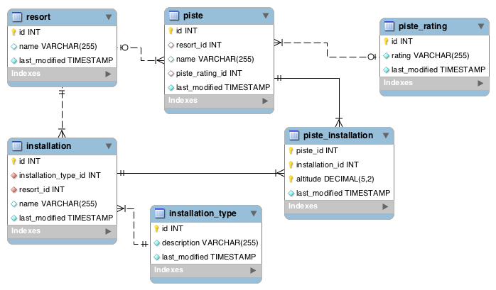

Battling a Legacy Schema With DBIx::Class

[Lee Johnson](http://leejo.github.io)

YAPC::{NA,EU} 2016

---
## Me?


[http://leejo.github.io/code](http://leejo.github.io/code)

---
## Why DBIx::Class?

For any non-trivial application you're going to write a model anyway.

Most trivial applications turn into non-trivial applications.

So "don't leak the abstraction"

DBIx::Class offers many useful features, as we shall see.

Note:
- quoting Ovid, who was quoting Joel Spolsky
- my first intro to dbic, don't want to go back
- no writing same SQL over and over
- concentrate on the business logic
- objects

---
### More about that Model

The ORM isn't your model, it *helps* your model.

<p class="fragment"> MVC </p>
<p class="fragment"> <font size=40>M</font>V<font size=3>C</font> </p>
<p class="fragment"> <font size=5>O</font><font size=40>M</font>V<font size=3>C</font> </p>

Note:
- thin controllers, fat model + ORM

---
### More about that Model

Abstract this away into your model:

```perl
$model->resultset( "Piste" )->find( 17 )->name;
```

Like so:

```perl
SkiResort::Model::Piste->new( id => 17 )->name;
```

Your controllers are then not coupled to the data store

And they know nothing about the ORM

Note:
- example: ./examples/slides/more_about_that_model.sh 17 (+ exception)
- controller(s) not tightly coupled to the schema
- model code makes the decisions on storage

---
### More about that Model

And you can better utilise exceptions:

```perl
try sub {
	...
	my $piste = SkiResort::Model::Piste->new( id => $piste_id );
	...
},
catch_when 'SkiResort::Exception::Database' => sub {
	# 500 error?
},
catch_when 'SkiResort::Exception::Input' => sub {
	# 400 error?
},
catch_default sub {
	# something else?
};
```

---
## Legacy Schema?

<p class="fragment"> Anything you didn't design yourself, right? </p>
<p class="fragment"> Well, anything that's grown organically. </p>
<p class="fragment"> Or used older tech and didn't keep up. </p>
<p class="fragment"> Maybe just full of technical debt? </p>
<p class="fragment"> Technical debt is *hard* to fix in your data store. </p>
<p class="fragment"> It's more like a mortgage on your stack. </p>
<p class="fragment"> So lets look at some examples. </p>

Note:
- tech debt: because often the code is tightly coupled to it
- mortgage: takes a long time to pay off, makes moving difficult, missing a payment can be catastrophic.
- a well designed schema: you can just about point DBIx::Class at it and run
- but we can still use dbic with a legacy schema, just needs some help
- following: how we can abstract problems away to ease paying off that debt.

---



A Ski Resort

Simple, [right?](img/villars_piste_map.pdf)

Note:
- This is done "right" (potentially subjective)
- Show villars_piste_map.pdf
- Because, for example, resort can be made of other resorts
- And a piste can be made of of many other pistes
- And you can have lifts that link resorts
- But keeping this simple enough for the examples
- And this is not the "legacy" schema...

---
## High Level Overview

```
11:31 <@ribasushi> if you have an existing gnarly database you want to wrap your head
                   around, vanstyn_'s rdbic is a superb tool building on top of the
                   ecosystem: http://www.catalystframework.org/calendar/2014/16
```

[RapidApp](https://github.com/RapidApp/yn2015)

```
rdbic.pl examples/db/legacy/resorts_legacy.db
```

Note:
- example: ./examples/slides/high_level_overview.sh

---
## Relationships (or lack thereof)

Note:
- there was once an aversion to these
- "they're slow"
- "they don't give us anything"
- "they make queries over complicated"
- The R in "RDBMS" is important

---
## Generating schema classes

```bash
#!/bin/bash

set -e
set -x

folder=$1
db_path=$2
overwrite=$3

dbicdump \
        -o debug=1 -o generate_pod=0 -o preserve_case=1 \
        -o dump_directory=$folder \
        -o components="[qw{InflateColumn::DateTime}]" \
        -o overwrite_modifications=$overwrite \
        -o datetime_timezone=UTC \
                'SkiResort::Model::LegacySchema' \
                'dbi:SQLite:dbname='$db_path''
```

Note:
- cd examples; sh db/gen_dbic_classes.sh lib db/legacy/resorts_legacy.db 1
- useful to have this as a script to rerun as required

---
## Generating schema classes

```perl
use utf8;
package SkiResort::Model::LegacySchema::Result::ResortItem;

# Created by DBIx::Class::Schema::Loader
# DO NOT MODIFY THE FIRST PART OF THIS FILE

use strict;
use warnings;

use base 'DBIx::Class::Core';
__PACKAGE__->load_components("InflateColumn::DateTime");
__PACKAGE__->table("resort_item");
__PACKAGE__->add_columns(
  "resort_id",
  { data_type => "integer", default_value => \"null", is_nullable => 1 },
  "item_source",
  { data_type => "varchar( 255 )", is_nullable => 1 },
  "item_id",
  { data_type => "integer", is_nullable => 0 },
);


# Created by DBIx::Class::Schema::Loader v0.07036 @ 2016-04-07 14:16:33
# DO NOT MODIFY THIS OR ANYTHING ABOVE! md5sum:kOaW4xm7IT+Y3qVDDBy2hg

# You can replace this text with custom code or comments, and it will be
# preserved on regeneration
1;
```

Note:
- gives us the base but we need to add relationships
- the relationships are where we can really use the power of dbic

---
## Adding relationships

```perl
# You can replace this text with custom code or comments, and it will be
# preserved on regeneration

__PACKAGE__->belongs_to(
  "resort",
  "SkiResort::Model::LegacySchema::Result::Resort",
  { id => "resort_id" },
  { is_deferrable => 0, on_delete => "CASCADE", on_update => "CASCADE" },
);

```

Which gives us:

```perl
$model->resultset( "ResortItem" )->first->resort->name;
```

And of course:

```perl
$model->resultset( "ResortItem" )->search( {},{ prefetch => [ qw/ resort / ] );
```

Note:
- example: ./examples/slides/adding_relationships.sh
- probably only want to add relationships as you need them
- i.e. no point in spending time adding them all
- but prefetch is an essential concept in optimisation

---
## Solving joins on polymorphic relationships


---
## Filtering columns


---
## Fixing data types with filters


---
## Virtual views and reports


---
## Query tracing and profiling


---
## Gotchas


---
## In Summary

+ Thin controllers, fat model
    - The ORM is *not* your model
    - Use it *in* your model
+ Foo
+ Boz
+ Biz

---
## Questions?

Links and resources:
